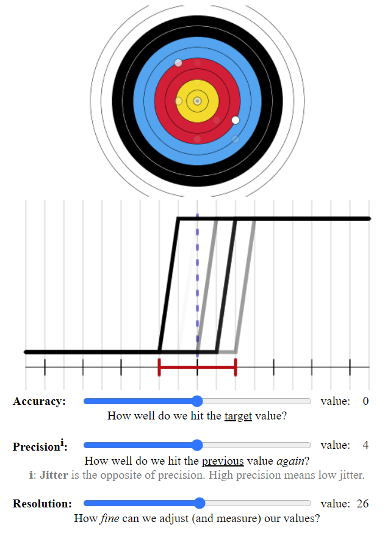
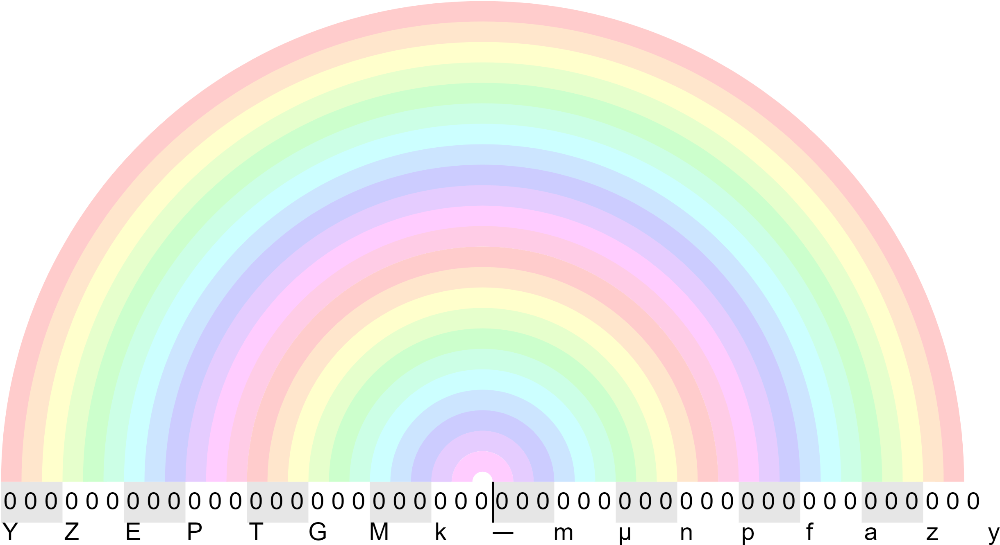

# rerossel.github.io

## JavaScript Jitter

This is a little [visualization](https://rerossel.github.io/JavaScript-Jitter/) project to learn JavaScript using the HTML5 canvas element.

---

## SI Prefix Rainbow

A visualization of how SI unit prefixes relate to each other.

